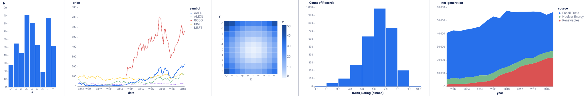

# feedzai-altair-theme 

Feedzai's theme for [Altair](https://github.com/altair-viz/altair) charts.

## Sneak peek



## Quickstart

### Installation

Via [pip](https://github.com/pypa/pip):

```bash
pip install feedzai-altair-theme
```

Via [Pipenv](https://pipenv.pypa.io/):

```bash
pipenv install feedzai-altair-theme
```

Via [Poetry](https://python-poetry.org/):

```bash
poetry add feedzai-altair-theme
```

Via [PDM](https://pdm.fming.dev/):

```bash
pdm add feedzai-altair-theme
```

### Usage

```python
import altair as alt

alt.themes.enable("feedzai")
```

You can find some example charts in the [`demo.ipynb` notebook](demo.ipynb).

## Development

Create the development environment:

```bash
make init
```

After implementing changes, run the command to check the types and to format and lint the code (you can also use the individual commands defined in the `Makefile`):

```bash
make all
```

To see the changes applied to some example charts, use the [`demo.ipynb` notebook](demo.ipynb):

```bash
make demo
```
